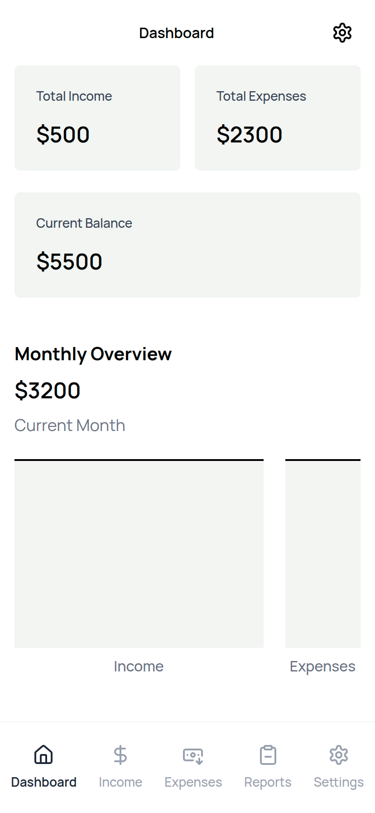
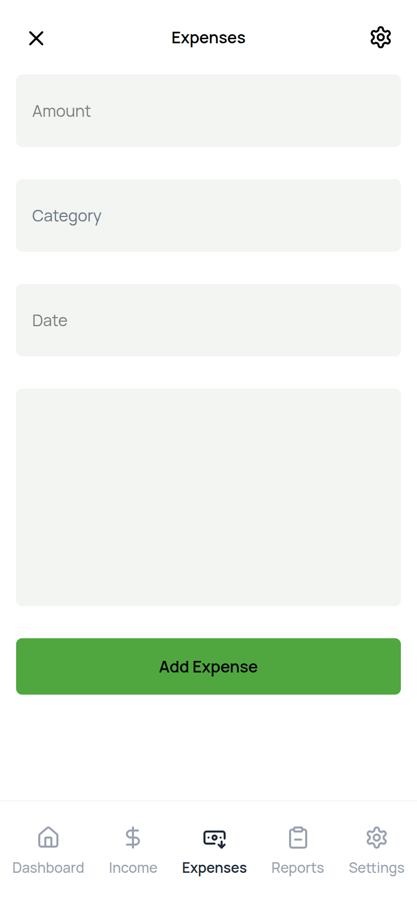
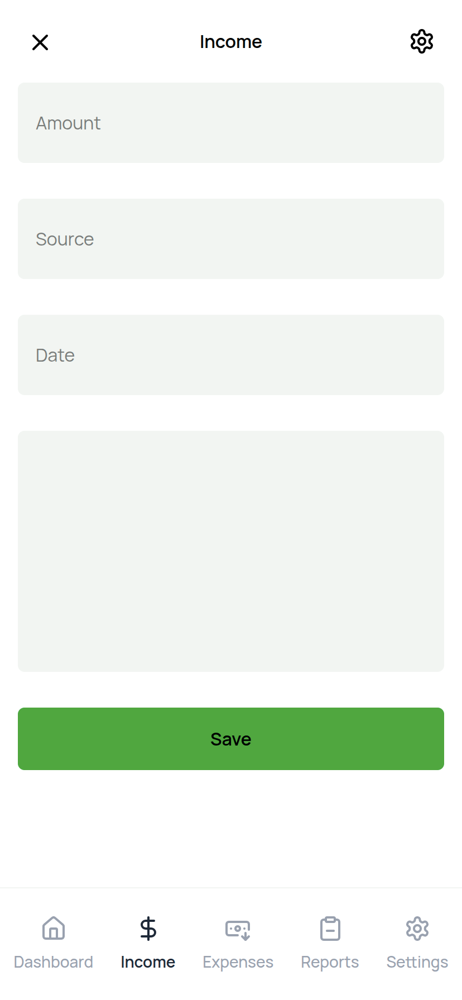
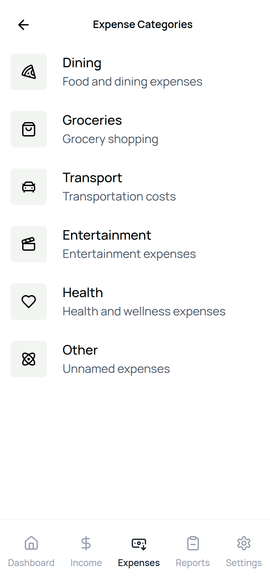
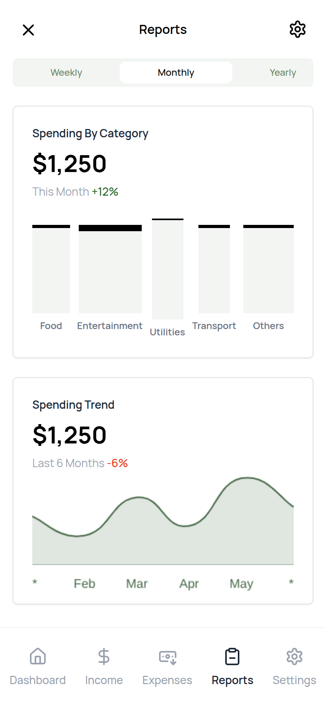
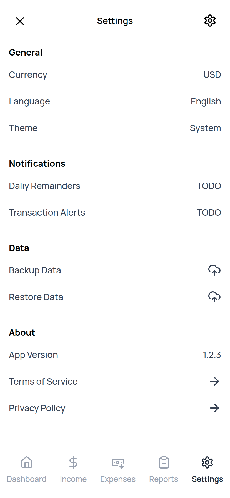

# Expense Tracker

A modern, cross-platform desktop application for managing your personal finances. Built with Tauri, React, and TypeScript, this app provides a fast, secure, and native-like experience for tracking your income and expenses.

## ✨ Features

-   **Dashboard:** Get a quick overview of your financial status with interactive charts.
-   **Expense Tracking:** Easily add, edit, and delete your daily expenses.
-   **Income Tracking:** Keep a record of your income sources.
-   **Categorization:** Organize your transactions into custom categories.
-   **Reports:** Generate detailed reports to understand your spending habits.
-   **Settings:** Customize the app to your preferences.

## 📸 Screenshots

| Dashboard                               | Expenses                               | Income                               |
| --------------------------------------- | -------------------------------------- | ------------------------------------ |
|  |  |  |

| Categories                               | Reports                               | Settings                               |
| ---------------------------------------- | ------------------------------------- | -------------------------------------- |
|  |  |  |

## 🛠️ Tech Stack

-   **[Tauri](https://tauri.app/):** A framework for building tiny, blazingly fast binaries for all major desktop platforms.
-   **[React](https://reactjs.org/):** A JavaScript library for building user interfaces.
-   **[TypeScript](https://www.typescriptlang.org/):** A typed superset of JavaScript that compiles to plain JavaScript.
-   **[Vite](https://vitejs.dev/):** A fast build tool that provides a quicker and leaner development experience.
-   **[Tailwind CSS](https://tailwindcss.com/):** A utility-first CSS framework for rapid UI development.
-   **[React Charts](https://react-charts.tanstack.com/):** Simple, immersive and interactive charts for React.
-   **[Lucide React](https://lucide.dev/):** A simply beautiful and consistent icon toolkit.

## 🚀 Getting Started

### Prerequisites

-   [Node.js](https://nodejs.org/en/)
-   [Rust](https://www.rust-lang.org/tools/install)
-   [Bun](https://bun.sh/)

### Installation

1.  Clone the repository:
    ```bash
    git clone https://github.com/your-username/expense-tracker.git
    cd expense-tracker
    ```

2.  Install the dependencies:
    ```bash
    bun install
    ```

### Development

To run the app in development mode, use the following command:

```bash
bun run tauri dev
```

### Building

To build the application for production, use the following command:

```bash
bun run tauri build
```

## 📄 License

This project is licensed under the MIT License. See the [LICENSE](LICENSE) file for details.
